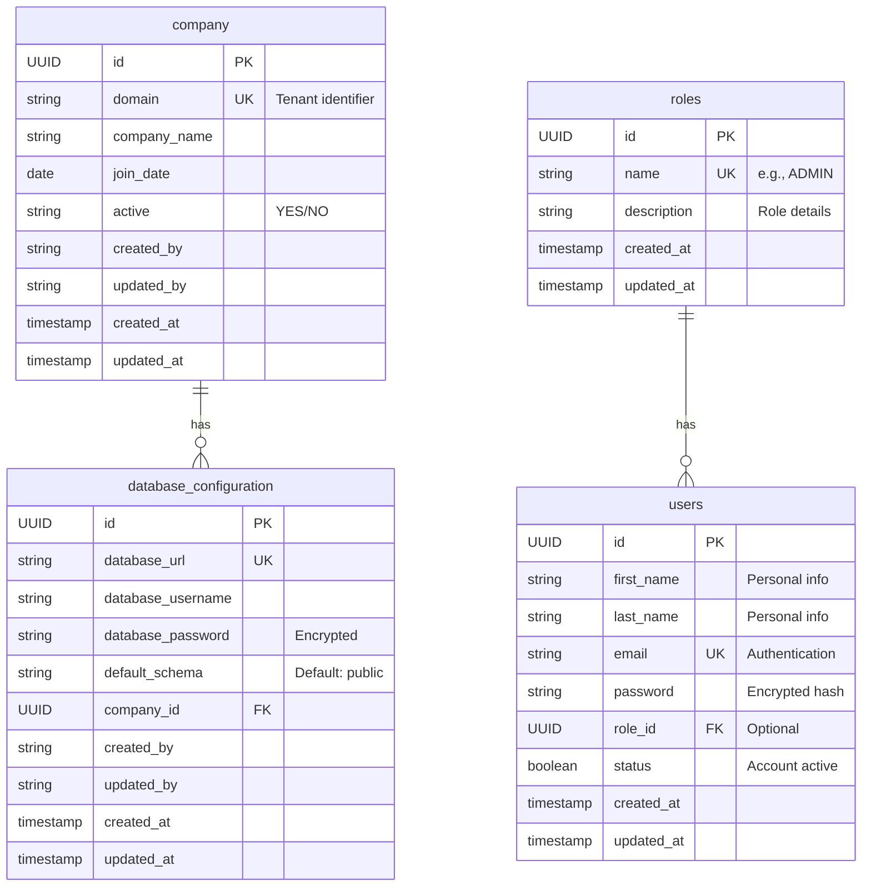
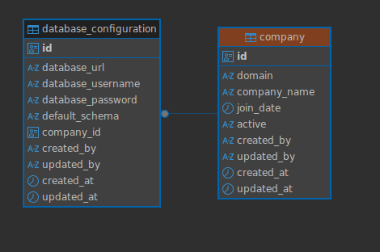

# Companies Multi-Tenant Service

A modular multi-tenant backend built with Spring Boot, Java 21, PostgreSQL, and JPA/Hibernate. It manages tenant (company) metadata and per-tenant database connection configuration plus user-related operations (sample Users API).

# Tenant Determination:
Each incoming request is associated with a tenant (company) by extracting a unique identifier, such as the domain, from a request header (e.g., X-Tenant). A Spring MVC interceptor (TenantFilter) processes this identifier, looks up the corresponding company in the database, and sets the tenant context for the request lifecycle. This enables per-tenant data isolation and configuration throughout the application..


---
## 1. Project Description

Purpose:
- Register and manage companies (tenants) with activation metadata.
- Store and relate each tenant to its database connection configuration (foundation for future isolation strategies: database-per-tenant or schema-per-tenant).
- Expose RESTful endpoints using Spring.
- Provide a clean separation between entrypoints, application use cases, domain models, and infrastructure adapters.

Key Features:
- Java 21 / Spring Boot 3.5.x
- Spring MVC (spring-boot-starter-web)
- Spring Data JPA + Hibernate + PostgreSQL
- Validation (Jakarta Validation API)
- Modular Gradle multi-project structure


---
## 2. Database Schema

Entities:
- company: Tenant master record. Stores information about each company/tenant in the system, including their domain identifier and activation status.
- database_configuration: Per-tenant database connection settings. Manages database connectivity for each tenant.
- users: System user management. Stores user profiles with authentication and authorization details, including personal information and role-based access control.
- roles: Role definitions for authorization. Defines available user roles and their descriptions for access control.

Table Descriptions:

### Company Table
Central registry for all tenants in the system.
- id: Unique identifier (UUID)
- domain: Unique tenant identifier for routing (e.g., 'company-a')
- company_name: Official company name
- join_date: Date when company joined the platform
- active: Activation status ('YES'/'NO')
- Audit fields: created_by, updated_by, created_at, updated_at

### Database Configuration Table
Stores connection details for each tenant's database.
- id: Unique identifier (UUID)
- database_url: JDBC connection URL
- database_username: Database user credentials
- database_password: Encrypted database password
- default_schema: Schema name (defaults to 'public')
- company_id: Reference to parent company
- Audit fields: created_by, updated_by, created_at, updated_at

### Users Table
Manages system users across all tenants.
- id: Unique identifier (UUID)
- first_name: User's first name
- last_name: User's last name
- email: Unique email address for authentication
- password: Encrypted password hash
- role_id: Reference to assigned role
- status: Account status (active/inactive)
- Audit fields: created_at, updated_at

### Roles Table
Defines available user roles for authorization.
- id: Unique identifier (UUID)
- name: Unique role name (e.g., 'ADMIN', 'USER')
- description: Role purpose and permissions
- Audit fields: created_at, updated_at

Relationships:
- One company has many database configurations (1:N)
- One role can be assigned to many users (1:N)
- Users must have valid email addresses (UNIQUE constraint)
- Role deletion doesn't cascade to users (SET NULL)

ER Diagram (Mermaid):


ER Diagram (Image):


<details><summary>SQL Schema</summary>

```sql
-- Core tenant management tables
CREATE TABLE company (
    id UUID PRIMARY KEY DEFAULT gen_random_uuid(),
    domain VARCHAR(255) NOT NULL UNIQUE,
    company_name VARCHAR(255) NOT NULL,
    join_date DATE NOT NULL,
    active VARCHAR NOT NULL,
    created_by VARCHAR(100) NOT NULL,
    updated_by VARCHAR(100),
    created_at TIMESTAMP DEFAULT CURRENT_TIMESTAMP,
    updated_at TIMESTAMP DEFAULT CURRENT_TIMESTAMP
);

CREATE INDEX idx_company_domain ON company(domain);
CREATE INDEX idx_company_join_date ON company(join_date);

CREATE TABLE database_configuration (
    id UUID PRIMARY KEY DEFAULT gen_random_uuid(),
    database_url VARCHAR(500) NOT NULL UNIQUE,
    database_username VARCHAR(100) NOT NULL,
    database_password VARCHAR(200) NOT NULL,
    default_schema VARCHAR(100) DEFAULT 'public',
    company_id UUID NOT NULL,
    created_by VARCHAR(100) NOT NULL,
    updated_by VARCHAR(100),
    created_at TIMESTAMP DEFAULT CURRENT_TIMESTAMP,
    updated_at TIMESTAMP DEFAULT CURRENT_TIMESTAMP,
    CONSTRAINT fk_database_company FOREIGN KEY (company_id)
        REFERENCES company(id)
        ON DELETE CASCADE
);

CREATE INDEX idx_database_company_id ON database_configuration(company_id);
CREATE INDEX idx_database_url ON database_configuration(database_url);

-- User management and authentication tables
CREATE TABLE roles (
    id UUID PRIMARY KEY DEFAULT gen_random_uuid(),
    name VARCHAR(50) NOT NULL UNIQUE,
    description TEXT,
    created_at TIMESTAMP DEFAULT CURRENT_TIMESTAMP,
    updated_at TIMESTAMP DEFAULT CURRENT_TIMESTAMP
);

CREATE TABLE users (
    id UUID PRIMARY KEY DEFAULT gen_random_uuid(),
    first_name VARCHAR(100) NOT NULL,
    last_name VARCHAR(100) NOT NULL,
    email VARCHAR(150) NOT NULL UNIQUE,
    password VARCHAR(255) NOT NULL,
    role_id UUID REFERENCES roles(id) ON DELETE SET NULL,
    status BOOLEAN DEFAULT TRUE,
    created_at TIMESTAMP DEFAULT CURRENT_TIMESTAMP,
    updated_at TIMESTAMP DEFAULT CURRENT_TIMESTAMP
);

-- Indexes for performance
CREATE INDEX idx_users_email ON users(email);
CREATE INDEX idx_users_role_id ON users(role_id);
CREATE INDEX idx_roles_name ON roles(name);

-- Initial role data
INSERT INTO roles (name, description) VALUES
('ADMIN', 'Full system access with all privileges'),
('USER', 'Standard user with basic access rights');
```
</details>

---
## 3. Technology Stack

| Layer | Technology |
|-------|------------|
| Language | Java 21 |
| Framework | Spring Boot 3.5.x |
| Web | Spring MVC (spring-boot-starter-web) |
| Persistence | Spring Data JPA + Hibernate |
| Database | PostgreSQL |
| Validation | Jakarta Validation (spring-boot-starter-validation) |
| Mapping | ModelMapper |
| Build | Gradle (multi-module) |
| Testing | Spring Boot Test / JUnit5 |

Note: WebFlux is NOT used. If any lingering WebFlux dependency appears in a parent build file, it can be safely removed.

## 4. Environment Variables
| Variable                  | Description                        | Example   |
|---------------------------|------------------------------------|-----------|
| APP_PORT                  | HTTP server port                   | 8080      |
| CONTEXT_PATH              | Base servlet context path           | /api/v1   |
| POSTGRES_DRIVER           | JDBC driver                        | org.postgresql.Driver |
| POSTGRES_HOST             | DB host                            | localhost |
| POSTGRES_PORT             | DB port                            | 5432      |
| POSTGRES_DB               | Database name                      | companies_core |
| POSTGRES_USER             | DB username                        | postgres  |
| POSTGRES_PASSWORD         | DB password                        | secret    |
| POSTGRES_DIALECT          | Hibernate dialect                  | org.hibernate.dialect.PostgreSQLDialect |
| SHOW_SQL                  | Print SQL (true/false)             | false     |
| HIBERNATE_DDL_AUTO        | Schema mode (none/update/validate) | none      |
| POSTGRES_READ_TIMEOUT     | Read timeout ms                    | 30000     |
| POSTGRES_CONNECTION_TIMEOUT | Connection timeout ms            | 5000      |
| POSTGRES_DEFAULT_SCHEMA   | Default schema                     | public    |
| POOL_SIZE                 | (Custom) pool size                 | 5         |
| TIME_LIFE_CONECTION       | (Custom) connection lifetime (s)   | 300       |
| CONNECTION_TIMEOUT        | (Custom) connection timeout (s)    | 10        |
| LOGGING_LEVEL             | Log level                          | INFO      |

Example `.env`:
```env
APP_PORT=8080
CONTEXT_PATH=/api/v1
POSTGRES_DRIVER=org.postgresql.Driver
POSTGRES_HOST=localhost
POSTGRES_PORT=5432
POSTGRES_DB=companies_core
POSTGRES_USER=postgres
POSTGRES_PASSWORD=secret
POSTGRES_DIALECT=org.hibernate.dialect.PostgreSQLDialect
SHOW_SQL=false
HIBERNATE_DDL_AUTO=none
POSTGRES_READ_TIMEOUT=30000
POSTGRES_CONNECTION_TIMEOUT=5000
POSTGRES_DEFAULT_SCHEMA=public
POOL_SIZE=5
TIME_LIFE_CONECTION=300
CONNECTION_TIMEOUT=10
LOGGING_LEVEL=INFO
```

---
## 5. API Documentation (Sample Endpoints)

Base Path: `http://localhost:${APP_PORT}${CONTEXT_PATH}`

| Method | Endpoint | Description |
|--------|----------|-------------|
| POST | /users | Create user |
| POST | /users/emails | Find user by email |
| GET | /users/{id} | Get user by ID |
| GET | /users | List all users |

---
## 6. License
Add a LICENSE file (e.g., MIT / Apache 2.0) and reference it here.
